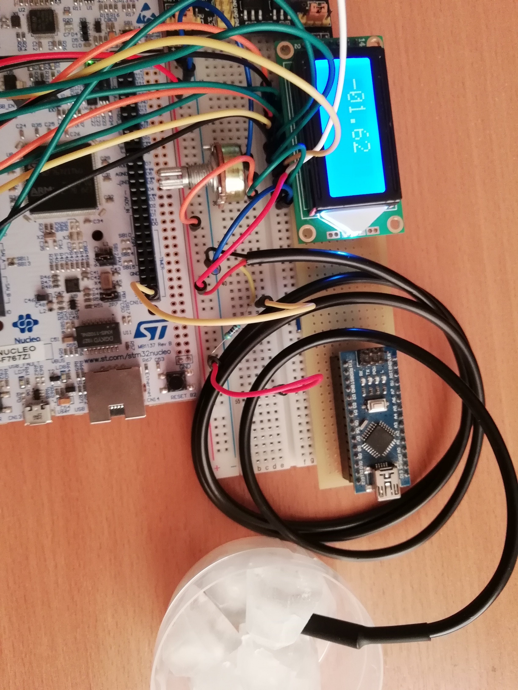

#STM32F7+DS18B20+LCD
__Project realization connection temperature sensor to STM32 and visualization result on LCD.__
###Pins
| Pins STM32        |LCD           | DS18B20  |
| ----------------- |:------------:| --------:|
| GRIO_D0           |DB0|
| GRIO_D1           |DB1|
| GRIO_D2           |DB2|
| GRIO_D3           |DB3|
| GRIO_D4           |DB4|
| GRIO_D5           |DB5|
| GRIO_D6           |DB6|
| GRIO_D7           |DB7|
| GPIO_C8           |RS |
| GPIO_C9           |R/W|
| GPIO_C10          |E  |
| GPIO_B11          |   |DATA|

###Using Devices:
Board- [STM32F7 Nucleo 144](https://www.st.com/en/microcontrollers-microprocessors/stm32f767zi.html)
Temperature sensor - [DS18B20 (1-Wire protocol)](https://datasheets.maximintegrated.com/en/ds/DS18B20.pdf)
LCD - [0802A](http://www.farnell.com/datasheets/50552.pdf)
###Example working:
